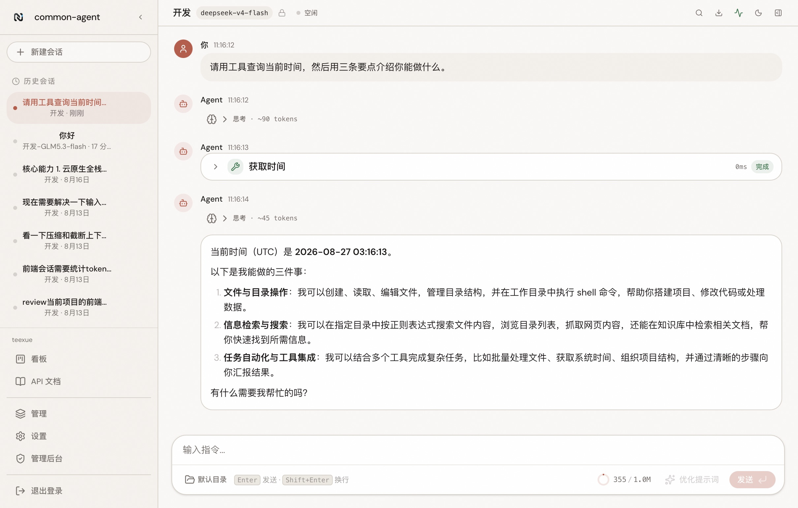
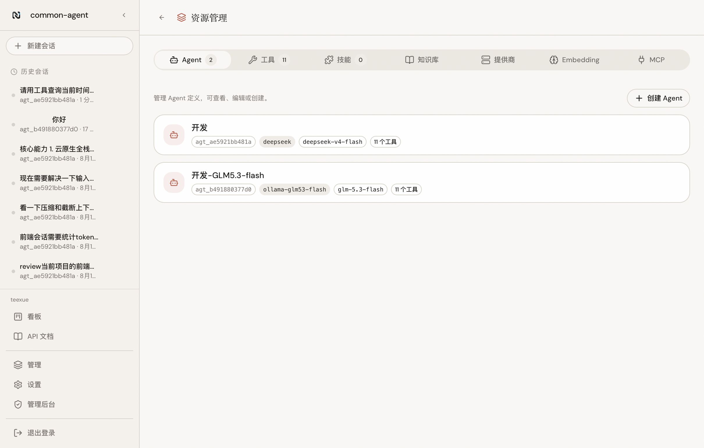
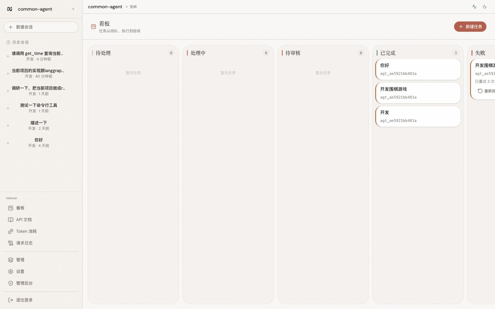
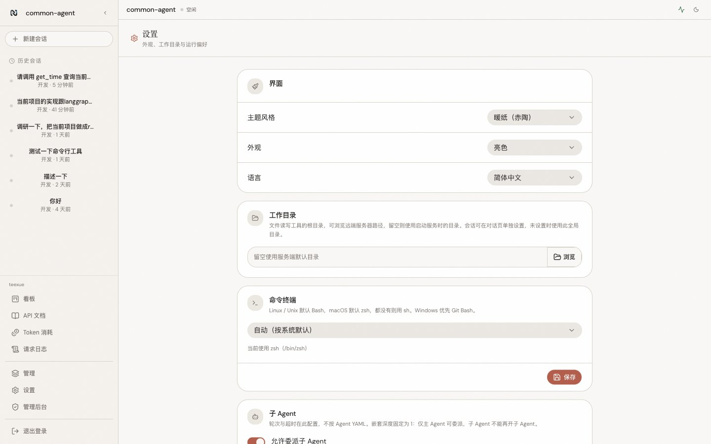
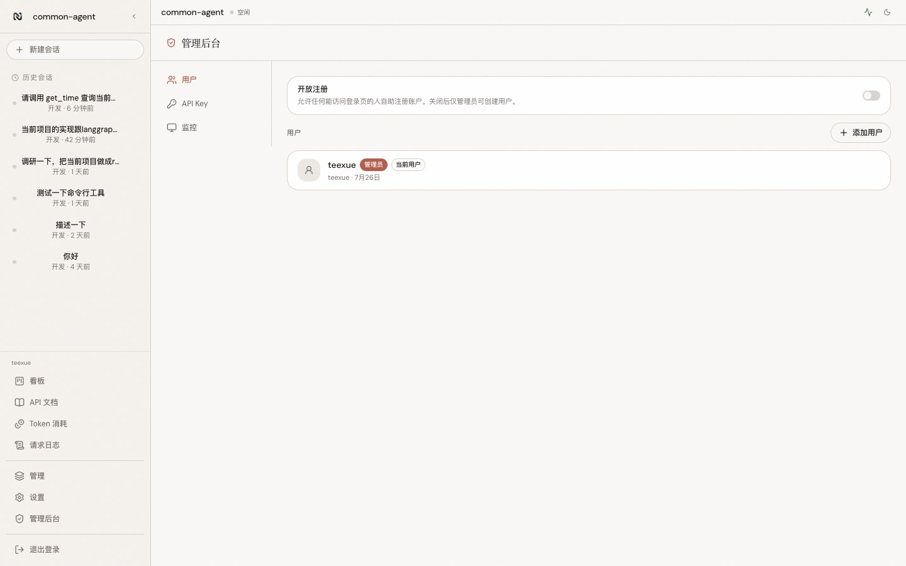

<div align="center">
  <h1>Common Agent</h1>
  <p><strong>面向生产环境的通用 Agent Runtime 基座</strong></p>
  <p>
    
    
    
  </p>
</div>

基于单一 Agent Loop 架构的自托管运行时。通过 YAML 配置定义 Agent，即可在终端、Web 界面或 API 中获得具备工具调用能力的 AI 助手。支持云端模型与本地 Ollama。

## 界面预览

对话工作区：工具调用、思考过程与 Markdown 回复。

<p align="center">
  
</p>

<table>
  <tr>
    <td width="50%"></td>
    <td width="50%"></td>
  </tr>
  <tr>
    <td align="center"><sub>资源管理 — Agent、工具、技能、知识库、提供商、MCP</sub></td>
    <td align="center"><sub>看板 — 任务流转与人工审核</sub></td>
  </tr>
  <tr>
    <td width="50%"></td>
    <td width="50%"></td>
  </tr>
  <tr>
    <td align="center"><sub>设置 — 主题、语言、工作目录与背景</sub></td>
    <td align="center"><sub>管理后台 — 用户、API Key、监控与审计</sub></td>
  </tr>
</table>

## 功能

- **多种使用方式** — 内置 Web 界面、HTTP SSE 接口、gRPC 流式接口，以及 TypeScript / Python SDK
- **配置驱动 Agent** — 一份 YAML 定义系统提示词、模型、工具与权限；也可复制已有 Agent 再调整
- **多模型提供商** — 支持 OpenAI 兼容接口（DeepSeek、Moonshot 等）、Anthropic，以及本地 Ollama，可按 Agent 切换
- **内置工具集** — 文件读写、目录浏览、内容搜索、Shell 命令、网页抓取等，开箱即用
- **MCP 扩展** — 接入 MCP Server 外部工具，全局或按 Agent 配置
- **权限与审批** — 细粒度工具权限策略，危险操作需人工确认后执行
- **会话管理** — 对话持久化，支持多会话切换与历史回放；可为会话指定工作目录
- **看板** — 任务卡片式管理，系统自动处理看板任务，完成后待人工审核，审核反馈可驱动重跑
- **知识库** — 文档导入与检索，Agent 回答时自动引用
- **技能系统** — 可复用的技能包（SKILL.md），按需加载扩展 Agent 能力
- **Web 界面** — 会话、资源管理、主题切换、自定义背景（含动态壁纸）等
- **可观测与审计** — 运行事件、健康检查与指标，支持审计查询
- **国际化** — 中英文界面与消息

## 快速开始

```bash
make                            # 构建（需要 Go 和 Node.js）
./bin/agent-server config init  # 初始化：配置模型提供商与 API Key
./bin/agent-server              # 启动 Web 界面（默认 :8080）
```
